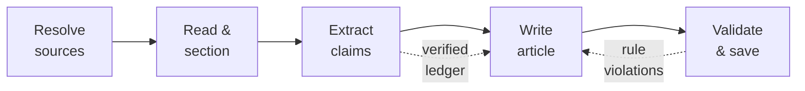

<!-- markdownlint-disable MD033 MD041 -->
<p align="center">
  <strong><code>ᚲ  D R A F T</code></strong>
</p>

<h1 align="center">draft</h1>

<p align="center">
  Turn research PDFs into grounded, publication-ready Markdown drafts — written by Claude when you are online, by a local Ollama model when you are not.
</p>

<p align="center">
  <a href="https://github.com/sebastienrousseau/draft/actions"></a>
  <a href="https://pkg.go.dev/github.com/sebastienrousseau/draft"></a>
  <a href="https://goreportcard.com/report/github.com/sebastienrousseau/draft"></a>
  <a href="#license"></a>
  <a href="#"></a>
</p>

---

## Contents

- [Why draft](#why-draft)
- [Install](#install)
- [Quick start](#quick-start)
- [How it works](#how-it-works)
- [Features](#features)
- [Usage](#usage)
- [Configuration](#configuration)
- [Architecture](#architecture)
- [Examples](#examples)
- [Development](#development)
- [Security](#security)
- [License](#license)

---

## Why draft

Small local models invent plausible facts. Large cloud models cost tokens and
need a network. `draft` gets the best of both: it writes with **Claude through
your existing `claude` CLI session** — no API token, it reuses the login you
already have — whenever the machine is online, and falls back to a **local
Ollama model** the moment the network drops. Either way, every draft is grounded
in a **verified claim ledger** mined from your sources, so the writer arranges
pre-checked facts instead of hallucinating new ones.

Point it at one paper or a stack of them. Each PDF becomes its own draft,
processed as a queue in a full-screen dashboard.

---

## Install

**With `go install`** (requires Go 1.24+):

```sh
go install github.com/sebastienrousseau/draft/cmd/draft@latest
```

**From source:**

```sh
git clone https://github.com/sebastienrousseau/draft
cd draft
make build          # builds ./bin/draft
```

**Runtime dependencies** (all optional depending on how you run):

| Tool                     | Needed for                        | Install (macOS)              |
| ------------------------ | --------------------------------- | ---------------------------- |
| `pdftotext` (Poppler)    | reading PDFs                      | `brew install poppler`       |
| `textutil`               | reading DOCX (built in on macOS) | —                            |
| [`claude`][claude]       | online writing via your session | Claude Code install          |
| [`ollama`][ollama]       | offline writing                  | `brew install ollama`        |

---

## Quick start

```sh
# One paper. Online → Claude; offline → Ollama. Bare names resolve
# against ~/Drop/Drafts/Sources.
draft "2603.23420.pdf"

# A stack of papers — three separate drafts, processed as a queue.
draft a.pdf b.pdf c.pdf

# See every flag and environment variable.
draft --help
```

The finished draft, the verified claim ledger, and any needs-review copies land
in `~/Drop/Drafts/YYYY-MM-DD/`.

---

## How it works

Every run is a five-phase, engine-agnostic pipeline:



1. **Read & section.** `pdftotext -layout` extracts the text, which is split on
   paper headings and hard-capped per section.
2. **Extract claims.** Each section is mined for facts. A claim survives only if
   its `SOURCE_QUOTE` is an exact substring of the section *and* every number in
   the claim appears in that quote.
3. **Write.** The compact claim ledger becomes the only permitted source of
   facts. If the backend stops on a length limit, `draft` continues generation
   rather than saving a truncated article.
4. **Validate & save.** Structure, length, banned vocabulary, emoji,
   truncation, and faithfulness are enforced; violations trigger a targeted
   rewrite before the draft is written to disk.

---

## Features

- **Zero-token Claude writing.** Uses the `claude` CLI in headless print mode,
  authenticated by your existing session.
- **Reliable offline fallback.** Auto mode always prefers Claude when the CLI is
  present; if a call fails because you are offline, it fails over to Ollama and
  stays there for the rest of the run — no flaky network probe gating the choice.
- **Grounded by construction.** A verbatim-quote-verified claim ledger is the
  writer's only factual substrate.
- **Bulk queue.** Pass many PDFs; each becomes its own draft, with live queue
  progress. `--merge` combines them into one.
- **Truncation-proof.** Detects length-limited stops and continues to a clean
  ending.
- **House-style enforcement.** Banned words and phrases, British English, no
  emoji, sentence-rhythm and structure rules — checked, not just requested.
- **Live dashboard.** A Bubble Tea TUI streams the article as it is written,
  with a pipeline view, per-run log, and a 25-minute focus timer.
- **Scriptable.** `--print` runs headless and emits draft paths to stdout.

---

## Usage

```text
draft [flags] <source> [more-sources...]
```

| Flag                    | Description                                             |
| ----------------------- | ------------------------------------------------------- |
| `--engine <mode>`       | `auto` (default), `claude`, or `ollama`                 |
| `--claude-model <name>` | Claude model when online (default `sonnet`; e.g. `opus`)|
| `--num-ctx <n>`         | Ollama context window (default `8192`)                  |
| `--num-predict <n>`     | Ollama max output tokens (default `6000`)               |
| `--force-new`           | Draft even if today's folder already has one            |
| `--merge`               | Combine all sources into one draft                      |
| `--print`               | Run without the TUI; print draft paths to stdout        |
| `--version`             | Print version and exit                                  |
| `-h, --help`            | Show help                                               |

---

## Configuration

Flags win over environment variables, which win over defaults.

| Variable               | Default     | Purpose                                     |
| ---------------------- | ----------- | ------------------------------------------- |
| `DRAFT_ENGINE`         | `auto`      | Backend selection                           |
| `DRAFT_CLAUDE_MODEL`   | `sonnet`    | Claude model when online                    |
| `DRAFT_MODEL`          | —           | Sets all Ollama models at once              |
| `DRAFT_WRITE_MODEL`    | `qwen3:4b`  | Ollama writing model                        |
| `DRAFT_EXTRACT_MODEL`  | `gemma3:4b` | Ollama claim-extraction model               |
| `DRAFT_EDIT_MODEL`     | `gemma3:4b` | Ollama surgical-review model                |
| `DRAFT_NUM_CTX`        | `8192`      | Ollama context window                       |
| `DRAFT_NUM_PREDICT`    | `6000`      | Ollama max output tokens                    |
| `DRAFT_WRITE_RETRIES`  | `2`         | Rewrite attempts on rule violations         |
| `DRAFT_MAX_CONTINUE`   | `3`         | Max continuations on a length-limited stop  |
| `OLLAMA_HOST`          | `http://127.0.0.1:11434` | Ollama server address          |

---

## Architecture

Standard Go layout: a thin `cmd/` entrypoint over focused `internal/` packages,
each with a single responsibility. The `Engine` interface is the key seam — the
pipeline is identical whether Claude or Ollama runs behind it.

```text
cmd/draft/          CLI entrypoint, flag parsing, headless mode
internal/
  config/           flag + env + default resolution
  pdf/              text extraction and section splitting
  rules/            shared editorial constants (banned words, limits)
  prompt/           grounded claim / writing / review prompts
  claims/           claim parsing, verbatim verification, ledger
  validate/         house-rule and faithfulness checks
  engine/           Engine interface, Claude + Ollama backends, routing
  pipeline/         orchestration, retries, continuation, fallback
  tui/              Bubble Tea dashboard and queue
```

The backend abstraction is a small, mockable interface — *accept interfaces,
return structs* — which is exactly how the test suite drives the whole pipeline
without touching a model:

```go
// Engine is the single seam every backend implements.
type Engine interface {
    Name() string
    Generate(ctx context.Context, req Request) (Result, error)
}

// Result.Truncated tells the pipeline to continue generation rather than
// save a mid-sentence article.
type Result struct {
    Text      string
    Truncated bool
}
```

---

## Examples

| Command                                          | What it does                                     |
| ------------------------------------------------ | ------------------------------------------------ |
| `draft "2603.23420.pdf"`                         | Draft one paper, engine auto-selected            |
| `draft a.pdf b.pdf c.pdf`                        | Queue three papers, one draft each               |
| `draft --merge notes.md paper.pdf`               | One draft from combined sources                  |
| `draft --engine ollama paper.pdf`                | Force the local model (offline)                  |
| `draft --claude-model opus paper.pdf`            | Use Opus when online                             |
| `draft --print paper.pdf > path.txt`             | Headless; capture the output path                |
| `DRAFT_NUM_CTX=2048 draft paper.pdf`             | Low-memory Ollama profile                        |

---

## Development

```sh
make build     # compile to ./bin/draft
make test      # run the unit + pipeline tests
make vet       # go vet ./...
make lint      # golangci-lint (if installed)
make fmt       # gofmt -s -w
make run ARGS='--help'
```

The pipeline is tested end to end against a deterministic fake `Engine`, so
correctness of extraction, grounding, truncation-continuation, and fallback is
verified without any network call or LLM.

---

## Security

- **No tokens on disk.** The Claude backend shells out to an already-authenticated
  CLI; `draft` never reads, stores, or logs an API key.
- **Prompt-injection aware.** Template and source text are quoted as untrusted
  evidence, and the writing prompt explicitly instructs the model to ignore any
  instructions found inside them.
- **Grounding as a safety control.** Ungrounded numbers and silent metric
  conversions are flagged; unverifiable claims are dropped before writing.
- **Bounded external calls.** Extraction shells out only to `pdftotext` /
  `textutil` with context timeouts and no shell interpolation.

---

## License

Released under the [MIT License](LICENSE). © Sebastien Rousseau.

[claude]: https://docs.claude.com/en/docs/claude-code
[ollama]: https://ollama.com
