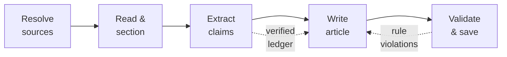

<!-- markdownlint-disable MD033 MD041 -->
<p align="center">
  <strong><code>ᚲ  D R A F T</code></strong>
</p>

<h1 align="center">draft</h1>

<p align="center">
  Turn research PDFs into grounded, publication-ready Markdown drafts — written by any token-free AI coding-agent session when you are online, by a local Ollama model when you are not.
</p>

<p align="center">
  <a href="https://github.com/sebastienrousseau/draft/actions"></a>
  <a href="https://pkg.go.dev/github.com/sebastienrousseau/draft"></a>
  <a href="#"></a>
  <a href="#license"></a>
  <a href="#"></a>
</p>

---

## Contents

- [Why draft](#why-draft)
- [Install](#install)
- [Quick start](#quick-start)
- [How it works](#how-it-works)
- [Providers](#providers)
- [Features](#features)
- [Usage](#usage)
- [Configuration](#configuration)
- [Architecture](#architecture)
- [Examples](#examples)
- [Development](#development)
- [Security](#security)
- [License](#license)

---

## Why draft

Small local models invent plausible facts. Cloud APIs cost tokens and need a
network. `draft` gets the best of both: online, it writes with **whatever AI
coding-agent CLI you already use** — Claude, Codex, Gemini, Copilot, Cursor,
Amp, Crush, Goose, Grok, Qwen — through that tool's **own logged-in session, so
there is no API token to manage**. Offline, it falls back to a **local Ollama
model**. Either way, every draft is grounded in a **verified claim ledger**
mined from your sources, so the writer arranges pre-checked facts instead of
hallucinating new ones.

Point it at one paper or a stack of them. Each PDF becomes its own draft,
processed as a queue in a full-screen dashboard — online or offline.

---

## Install

**With `go install`** (requires Go 1.24+):

```sh
go install github.com/sebastienrousseau/draft/cmd/draft@latest
```

**From source:**

```sh
git clone https://github.com/sebastienrousseau/draft
cd draft
make build          # builds ./bin/draft
```

**Runtime dependencies** (all optional depending on how you run):

| Tool                     | Needed for                        | Install (macOS)              |
| ------------------------ | --------------------------------- | ---------------------------- |
| `pdftotext` (Poppler)    | reading PDFs                      | `brew install poppler`       |
| `textutil`               | reading DOCX (macOS-only)         | built in                     |
| a session CLI            | online writing via your session | [`claude`][claude], `codex`, `gemini`, … |
| [`ollama`][ollama]       | offline writing                  | `brew install ollama`        |

Runs on **macOS, Linux, and Windows** (release binaries for all three). PDF,
Markdown, and text sources work everywhere; DOCX is macOS-only.

---

## Quick start

```sh
# One paper. Online → Claude; offline → Ollama. Bare names resolve
# against ~/Drop/Drafts/Sources.
draft "2603.23420.pdf"

# A stack of papers — three separate drafts, processed as a queue.
draft a.pdf b.pdf c.pdf

# See every flag and environment variable.
draft --help
```

The finished draft, the verified claim ledger, and any needs-review copies land
in `~/Drop/Drafts/YYYY-MM-DD/`.

---

## How it works

Every run is a five-phase, engine-agnostic pipeline:



1. **Read & section.** `pdftotext -layout` extracts the text, which is split on
   paper headings and hard-capped per section.
2. **Extract claims.** Each section is mined for facts. A claim survives only if
   its `SOURCE_QUOTE` is an exact substring of the section *and* every number in
   the claim appears in that quote.
3. **Write.** The compact claim ledger becomes the only permitted source of
   facts. If the backend stops on a length limit, `draft` continues generation
   rather than saving a truncated article.
4. **Validate & save.** Structure, length, banned vocabulary, emoji,
   truncation, and faithfulness are enforced; violations trigger a targeted
   rewrite. On success only the finished article is kept — scratch files are
   removed unless you pass `--keep-artifacts`.

---

## Providers

In `auto` mode `draft` uses the first installed **stable** CLI on your `PATH`,
in order, driving it through its own logged-in session (no API token).
**Experimental** providers — invocation correct per their `--help`, but article
output not yet verified end to end — are used by auto only with
`--experimental`; any provider can be forced by name with `--engine <name>`.

| Provider | Status | Headless invocation |
| -------- | ------ | ------------------- |
| `claude` | stable | `claude -p --output-format stream-json` (live-streamed) |
| `copilot` | stable | `copilot -p --allow-all-tools` |
| `codex` | stable | `codex exec` |
| `agy` | stable | `agy -p` (Google Antigravity) |
| `cursor-agent` | stable | `cursor-agent -p --output-format text --force` |
| `amp` | experimental | `amp -x` |
| `crush` | experimental | `crush run` |
| `goose` | experimental | `goose run --no-session -t` |
| `grok` | stable | `grok --output-format plain --single` |
| `qwen` | experimental | `qwen -p` |

Run `go run ./examples/providers` to see status and which are installed.

---

## Features

- **Zero-token, any-agent writing.** Drives whichever coding-agent CLI you have
  in headless mode, authenticated by that tool's own session — no API key.
- **Reliable offline fallback.** No up-front network probe: if a session call
  fails because you are offline, `draft` advances along the chain and finally to
  a local Ollama model, and stays there for the rest of the run.
- **Grounded by construction.** A verbatim-quote-verified claim ledger is the
  writer's only factual substrate.
- **Bulk queue, online or offline.** Pass many PDFs; each becomes its own draft
  with live queue progress, and each re-selects its engine independently.
  `--merge` combines them into one.
- **Fast, parallel grounding.** On a session provider, claim extraction runs
  across sections concurrently (Ollama stays sequential); a failed worker retries
  down the fallback chain.
- **Live streaming.** The Claude backend uses the `stream-json` event format, so
  the preview fills token-by-token instead of in one jump.
- **Enhance, don't rewrite.** `--review <draft.md>` asks the model for exact
  find/replace edits grounded in your sources, applies only unique non-overlapping
  ones, and re-checks the house rules before saving.
- **Truncation-proof.** Detects length-limited stops and continues to a clean
  ending.
- **House-style enforcement.** Banned words and phrases, British English, no
  emoji, sentence-rhythm and structure rules — checked, not just requested.
- **Tidy output.** A successful run leaves only the article in the dated folder.
- **Live dashboard.** A Bubble Tea TUI streams the article as it is written,
  with a pipeline view, per-run log, and a 25-minute focus timer.
- **Scriptable.** `--print` runs headless and emits draft paths to stdout.

---

## Usage

```text
draft [flags] <source> [more-sources...]
```

| Flag                | Description                                              |
| ------------------- | ------------------------------------------------------- |
| `--engine <mode>`   | `auto` (default), `ollama`, or a provider name          |
| `--model <name>`    | Session-provider model override (e.g. `opus`)           |
| `--experimental`    | Let auto mode use experimental providers                |
| `--num-ctx <n>`     | Ollama context window (default `8192`)                  |
| `--num-predict <n>` | Ollama max output tokens (default `6000`)               |
| `--force-new`       | Draft even if today's folder already has one            |
| `--merge`           | Combine all sources into one draft                      |
| `--review <draft>`  | Enhance an existing draft with surgical edits           |
| `--keep-artifacts`  | Keep the claim ledger beside a successful draft         |
| `--print`           | Run without the TUI; print draft paths to stdout        |
| `--version`         | Print version and exit                                  |
| `-h, --help`        | Show help                                               |

---

## Configuration

Flags win over environment variables, which win over defaults.

| Variable               | Default     | Purpose                                     |
| ---------------------- | ----------- | ------------------------------------------- |
| `DRAFT_ENGINE`         | `auto`      | Backend selection (auto, ollama, provider)  |
| `DRAFT_MODEL_SESSION`  | —           | Session-provider model override             |
| `DRAFT_MODEL`          | —           | Sets all Ollama models at once              |
| `DRAFT_WRITE_MODEL`    | `qwen3:4b`  | Ollama writing model                        |
| `DRAFT_EXTRACT_MODEL`  | `gemma3:4b` | Ollama claim-extraction model               |
| `DRAFT_EDIT_MODEL`     | `gemma3:4b` | Ollama surgical-review model                |
| `DRAFT_NUM_CTX`        | `8192`      | Ollama context window                       |
| `DRAFT_NUM_PREDICT`    | `6000`      | Ollama max output tokens                    |
| `DRAFT_WRITE_RETRIES`  | `2`         | Rewrite attempts on rule violations         |
| `DRAFT_MAX_CONTINUE`   | `3`         | Max continuations on a length-limited stop  |
| `DRAFT_EXTRACT_CONCURRENCY` | `4`    | Parallel extraction workers (session engines) |
| `DRAFT_EXPERIMENTAL`   | —           | `1` to let auto use experimental providers  |
| `OLLAMA_HOST`          | `http://127.0.0.1:11434` | Ollama server address          |

---

## Architecture

Standard Go layout: a thin `cmd/` entrypoint over focused `internal/` packages,
each with a single responsibility. The `Engine` interface is the key seam — the
pipeline is identical whether a session provider or Ollama runs behind it.

```text
cmd/draft/          CLI entrypoint, flag parsing, headless mode
internal/
  config/           flag + env + default resolution
  pdf/              text extraction and section splitting
  rules/            shared editorial constants (banned words, limits)
  prompt/           grounded claim / writing / review prompts
  claims/           claim parsing, verbatim verification, ledger
  validate/         house-rule and faithfulness checks
  engine/           Engine interface, session-provider registry, Ollama, routing
  pipeline/         orchestration, retries, continuation, fallback chain
  tui/              Bubble Tea dashboard and queue
examples/           runnable, network-free demos of each capability
```

The backend abstraction is a small, mockable interface — *accept interfaces,
return structs* — which is exactly how the test suite drives the whole pipeline
without touching a model:

```go
// Engine is the single seam every backend implements.
type Engine interface {
    Name() string
    Generate(ctx context.Context, req Request) (Result, error)
}

// Result.Truncated tells the pipeline to continue generation rather than
// save a mid-sentence article.
type Result struct {
    Text      string
    Truncated bool
}
```

---

## Examples

| Command                                          | What it does                                     |
| ------------------------------------------------ | ------------------------------------------------ |
| `draft "2603.23420.pdf"`                         | Draft one paper, engine auto-selected            |
| `draft a.pdf b.pdf c.pdf`                        | Queue three papers, one draft each               |
| `draft --merge notes.md paper.pdf`               | One draft from combined sources                  |
| `draft --engine ollama paper.pdf`                | Force the local model (offline)                  |
| `draft --engine codex paper.pdf`                 | Force a specific session provider                |
| `draft --model opus paper.pdf`                   | Override the session model                        |
| `draft --review draft.md paper.pdf`              | Enhance an existing draft from the source         |
| `draft --print paper.pdf > path.txt`             | Headless; capture the output path                |
| `DRAFT_NUM_CTX=2048 draft paper.pdf`             | Low-memory Ollama profile                        |

Runnable, network-free library demos live in [`examples/`](examples):

```sh
go run ./examples/providers   # list providers and which CLIs are installed
go run ./examples/grounding   # claim verification, ledger, prompt, validation
go run ./examples/pipeline    # the full pipeline against an in-process engine
```

---

## Development

```sh
make build     # compile to ./bin/draft
make test      # run the unit + pipeline tests
make cover     # coverage report (≥95%)
make bench     # run benchmarks
make vet       # go vet ./...
make lint      # golangci-lint (config in .golangci.yml)
make fmt       # gofmt -s -w
make run ARGS='--help'
```

The suite covers **≥95% of statements**. The pipeline is tested end to end
against a deterministic fake `Engine` — extraction, grounding,
truncation-continuation, and multi-provider fallback are verified without any
network call or LLM — and provider CLIs are faked via the `TestHelperProcess`
pattern, so even the session backends are covered without spawning real agents.

---

## Security

- **No tokens on disk.** Session backends shell out to an already-authenticated
  CLI; `draft` never reads, stores, or logs an API key.
- **Prompt-injection aware.** Template and source text are quoted as untrusted
  evidence, and the writing prompt explicitly instructs the model to ignore any
  instructions found inside them.
- **Agent trust surface.** Session providers run in their non-interactive modes,
  some of which auto-approve tool use (for example `copilot --allow-all-tools`,
  `cursor-agent --force`, `amp -x`). `draft` asks only for text and quotes your
  sources as untrusted, but
  you are still handing a research PDF to an agent that *can* act — treat sources
  as you would any untrusted input, and prefer Ollama for material you do not
  trust.
- **Cancellation.** Quitting the dashboard (or Ctrl+C in `--print`) cancels the
  run's context, terminating any in-flight provider subprocess or Ollama request.
- **Grounding as a safety control.** Ungrounded numbers and silent metric
  conversions are flagged; unverifiable claims are dropped before writing.
- **Bounded external calls.** Extraction shells out only to `pdftotext` /
  `textutil` (macOS) with context timeouts and no shell interpolation.

---

## License

Licensed under either of [Apache License 2.0](LICENSE-APACHE) or
[MIT License](LICENSE-MIT) at your option. © Sebastien Rousseau.

Unless you explicitly state otherwise, any contribution intentionally submitted
for inclusion in the work by you shall be dual licensed as above, without any
additional terms or conditions.

[claude]: https://docs.claude.com/en/docs/claude-code
[ollama]: https://ollama.com
