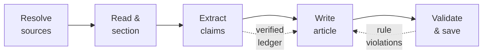

<!-- markdownlint-disable MD033 MD041 -->
<p align="center">
  <strong><code>ᚲ  D R A F T</code></strong>
</p>

<h1 align="center">draft</h1>

<p align="center">
  Turn research PDFs into grounded, publication-ready Markdown drafts — written by any token-free AI coding-agent session when you are online, by a local Ollama model when you are not.
</p>

<p align="center">
  <a href="https://github.com/sebastienrousseau/draft/actions"></a>
  <a href="https://pkg.go.dev/github.com/sebastienrousseau/draft"></a>
  <a href="https://github.com/sebastienrousseau/draft/actions/workflows/ci.yml"></a>
  <a href="#license"></a>
  <a href="#"></a>
</p>

---

## Contents

**Getting started**

- [Why draft](#why-draft)
- [Install](#install)
- [Quick start](#quick-start)
- [How it works](#how-it-works)

**Reference**

- [Providers](#providers)
- [Features](#features)
- [Usage](#usage)
- [Article sets & frontmatter](#article-sets--frontmatter)
- [Configuration](#configuration)
- [Architecture](#architecture)
- [Library usage](#library-usage)
- [Examples](#examples)

**Operational**

- [When not to use draft](#when-not-to-use-draft)
- [Development](#development)
- [Security](#security)
- [Documentation](#documentation)
- [License](#license)

---

## Why draft

Small local models invent plausible facts. Cloud APIs cost tokens and need a
network. `draft` gets the best of both: online, it writes with **whatever AI
coding-agent CLI you already use** — Claude, Codex, Gemini, Copilot, Cursor,
Amp, Crush, Goose, Grok, Qwen — through that tool's **own logged-in session, so
there is no API token to manage**. Offline, it falls back to a **local Ollama
model**. Either way, every draft is grounded in a **verified claim ledger**
mined from your sources, so the writer arranges pre-checked facts instead of
hallucinating new ones.

Point it at one paper or a stack of them. Each PDF becomes its own draft,
processed as a queue in a full-screen dashboard — online or offline.

---

## Install

**With `go install`** (requires Go 1.24+):

```sh
go install github.com/sebastienrousseau/draft/cmd/draft@latest
```

**From source:**

```sh
git clone https://github.com/sebastienrousseau/draft
cd draft
make build          # builds ./bin/draft
```

**Runtime dependencies** (all optional depending on how you run):

| Tool                     | Needed for                        | Install (macOS)              |
| ------------------------ | --------------------------------- | ---------------------------- |
| `pdftotext` (Poppler)    | reading PDFs                      | `brew install poppler`       |
| `textutil`               | reading DOCX (macOS-only)         | built in                     |
| a session CLI            | online writing via your session | [`claude`][claude], `codex`, `gemini`, … |
| [`ollama`][ollama]       | offline writing                  | `brew install ollama`        |

Runs on **macOS, Linux, and Windows** (release binaries for all three). PDF,
Markdown, and text sources work everywhere; DOCX is macOS-only.

---

## Quick start

```sh
# One paper. Online → Claude; offline → Ollama. Bare names resolve
# against ~/Drop/Drafts/Sources.
draft "2603.23420.pdf"

# A stack of papers — three separate drafts, processed as a queue.
draft a.pdf b.pdf c.pdf

# See every flag and environment variable.
draft --help
```

The finished draft, the verified claim ledger, and any needs-review copies land
in `~/Drop/Drafts/YYYY-MM-DD/`.

---

## How it works

Every run is a five-phase, engine-agnostic pipeline:


```mermaid
flowchart LR
    A[Resolve<br/>sources] --> B[Read &<br/>section]
    B --> C[Extract<br/>claims]
    C --> D[Write<br/>article]
    D --> E[Validate<br/>& save]
    C -. verified<br/>ledger .-> D
    E -. rule<br/>violations .-> D
```

1. **Read & section.** `pdftotext -layout` extracts the text, which is split on
   paper headings and hard-capped per section.
2. **Extract claims.** Each section is mined for facts. A claim survives only if
   its `SOURCE_QUOTE` is an exact substring of the section *and* every number in
   the claim appears in that quote.
3. **Write.** The compact claim ledger becomes the only permitted source of
   facts. If the backend stops on a length limit, `draft` continues generation
   rather than saving a truncated article.
4. **Validate & save.** Structure, length, banned vocabulary, emoji,
   truncation, and faithfulness are enforced; violations trigger a targeted
   rewrite. On success only the finished article is kept — scratch files are
   removed unless you pass `--keep-artifacts`.

---

## Providers

In `auto` mode `draft` uses the first installed **stable** CLI on your `PATH`,
in order, driving it through its own logged-in session (no API token).
**Experimental** providers — invocation correct per their `--help`, but article
output not yet verified end to end — are used by auto only with
`--experimental`; any provider can be forced by name with `--engine <name>`.

| Provider | Status | Headless invocation |
| -------- | ------ | ------------------- |
| `claude` | stable | `claude -p --output-format stream-json` (live-streamed) |
| `copilot` | stable | `copilot -p --allow-all-tools` |
| `codex` | stable | `codex exec` |
| `agy` | stable | `agy -p` (Google Antigravity) |
| `cursor-agent` | stable | `cursor-agent -p --output-format text --force` |
| `amp` | experimental | `amp -x` |
| `crush` | experimental | `crush run` |
| `goose` | experimental | `goose run --no-session -t` |
| `grok` | stable | `grok --output-format plain --single` |
| `qwen` | experimental | `qwen -p` |

Run `go run ./examples/providers` to see status and which are installed.

---

## Features

- **Zero-token, any-agent writing.** Drives whichever coding-agent CLI you have
  in headless mode, authenticated by that tool's own session — no API key.
- **Reliable offline fallback.** No up-front network probe: if a session call
  fails because you are offline, `draft` advances along the chain and finally to
  a local Ollama model, and stays there for the rest of the run.
- **Grounded by construction.** A verbatim-quote-verified claim ledger is the
  writer's only factual substrate.
- **Bulk queue, online or offline.** Pass many PDFs; each becomes its own draft
  with live queue progress, and each re-selects its engine independently.
  `--merge` combines them into one.
- **Fast, parallel grounding.** On a session provider, claim extraction runs
  across sections concurrently (Ollama stays sequential); a failed worker retries
  down the fallback chain.
- **Live streaming.** The Claude backend uses the `stream-json` event format, so
  the preview fills token-by-token instead of in one jump.
- **Enhance, don't rewrite.** `--review <draft.md>` asks the model for exact
  find/replace edits grounded in your sources, applies only unique non-overlapping
  ones, and re-checks the house rules before saving.
- **Truncation-proof.** Detects length-limited stops and continues to a clean
  ending.
- **House-style enforcement.** Banned words and phrases, British English, no
  emoji, sentence-rhythm and structure rules — checked, not just requested.
- **Publish-ready output sets.** Every draft is saved three ways under the
  dated folder — `source/` (body only), `yaml/` (adjacent frontmatter), and
  `final/` (combined, ready to publish) — and `--frontmatter <file>`
  regenerates a set from an edited body without losing curated metadata.
- **Live dashboard.** A Bubble Tea TUI streams the article as it is written,
  with a pipeline view, per-run log, and a 25-minute focus timer.
- **Scriptable.** `--print` runs headless and emits draft paths to stdout.

---

## Usage

```text
draft [flags] <source> [more-sources...]
```

| Flag                | Description                                              |
| ------------------- | ------------------------------------------------------- |
| `--engine <mode>`   | `auto` (default), `ollama`, or a provider name          |
| `--model <name>`    | Session-provider model override (e.g. `opus`)           |
| `--experimental`    | Let auto mode use experimental providers                |
| `--num-ctx <n>`     | Ollama context window (default `8192`)                  |
| `--num-predict <n>` | Ollama max output tokens (default `6000`)               |
| `--force-new`       | Draft even if today's folder already has one            |
| `--merge`           | Combine all sources into one draft                      |
| `--review <draft>`  | Enhance an existing draft with surgical edits           |
| `--frontmatter <f>` | Regenerate frontmatter + final doc from an article file |
| `--combine <f>`     | Alias for `--frontmatter`                               |
| `--keep-artifacts`  | Keep the claim ledger beside a successful draft         |
| `--print`           | Run without the TUI; print draft paths to stdout        |
| `--version`         | Print version and exit                                  |
| `-h, --help`        | Show help                                               |

---

## Article sets & frontmatter

A successful draft is saved as a three-file set under the dated output
folder:

```text
2026-07-27/
├── source/2026-07-27-<slug>-body.md         # article body only — edit this
├── yaml/2026-07-27-<slug>-frontmatter.yaml  # adjacent YAML frontmatter
└── final/2026-07-27-<slug>-final.md         # frontmatter + body, publishable
```

After editing a body file, regenerate its yaml and final documents in place:

```sh
draft --frontmatter 2026-07-27/source/2026-07-27-<slug>-body.md
```

Regeneration follows three rules:

1. **The filename is the article's identity.** Its `YYYY-MM-DD` prefix and
   slug drive every date and URL in the frontmatter, so regenerating later —
   or after a retitle — never changes the permalink.
2. **Existing frontmatter always wins.** Curated fields are preserved
   verbatim; only missing fields are generated from the body. Delete a field
   from the yaml file to have it regenerated.
3. **Unchanged input is a no-op.** Reprocessing a set that has not changed
   rewrites every file byte-identically.

`--review` respects the same boundaries: the model only ever sees the article
body, the frontmatter is re-attached on save, and reviewing one file of a set
resyncs its siblings.

---

## Configuration

Flags win over environment variables, which win over defaults.

| Variable               | Default     | Purpose                                     |
| ---------------------- | ----------- | ------------------------------------------- |
| `DRAFT_ENGINE`         | `auto`      | Backend selection (auto, ollama, provider)  |
| `DRAFT_MODEL_SESSION`  | —           | Session-provider model override             |
| `DRAFT_MODEL`          | —           | Sets all Ollama models at once              |
| `DRAFT_WRITE_MODEL`    | `gemma3:4b` | Ollama writing model                        |
| `DRAFT_EXTRACT_MODEL`  | `gemma3:4b` | Ollama claim-extraction model               |
| `DRAFT_EDIT_MODEL`     | `gemma3:4b` | Ollama surgical-review model                |
| `DRAFT_NUM_CTX`        | `8192`      | Ollama context window                       |
| `DRAFT_NUM_PREDICT`    | `6000`      | Ollama output-token ceiling (auto-scaled down per draft) |
| `DRAFT_WRITE_RETRIES`  | `2`         | Rewrite attempts on rule violations         |
| `DRAFT_MAX_CONTINUE`   | `3`         | Max continuations on a length-limited stop  |
| `DRAFT_EXTRACT_CONCURRENCY` | `4`    | Parallel extraction workers (session engines) |
| `DRAFT_EXPERIMENTAL`   | —           | `1` to let auto use experimental providers  |
| `DRAFT_SITE_*`         | see below   | Frontmatter publisher identity overrides    |
| `OLLAMA_HOST`          | `http://127.0.0.1:11434` | Ollama server address          |

### Publisher identity

Generated frontmatter stamps a publisher identity (author, URLs, social
handles, analytics ID). Override any part of it with `DRAFT_SITE_*`
environment variables — unset variables keep the defaults, and curated
frontmatter fields always win over generated ones regardless:

| Variable | Overrides |
| -------- | --------- |
| `DRAFT_SITE_BASE_URL` | Canonical site root for permalinks and URLs |
| `DRAFT_SITE_CDN` | Asset host for banners, logos, images |
| `DRAFT_SITE_NAME` | Display name |
| `DRAFT_SITE_SHORT_NAME` | Slug-like identity used in asset paths |
| `DRAFT_SITE_EMAIL` | Contact address for author/webmaster fields |
| `DRAFT_SITE_TWITTER` | Twitter/X handle |
| `DRAFT_SITE_LOCATION` | Humans.txt location |
| `DRAFT_SITE_MEASUREMENT_ID` | Analytics measurement ID |
| `DRAFT_SITE_COPYRIGHT_FROM` | First year of the copyright range |

### Offline performance

The offline path is tuned for a memory-constrained laptop (8 GB) and gets most of
its speed from three things:

- **One shared model.** Extraction and writing both use `gemma3:4b`, so the
  server never swaps a second 4B model in and out mid-run. gemma also follows the
  writing brief closely — it keeps to the word budget and does not leak planning
  text into the article, so drafts usually pass the house rules on the first try.
- **Length scaled to the evidence.** The target word count is derived from the
  number of verified claims, and the output-token limit is sized to match. A thin
  ledger produces a short, fully-grounded piece instead of a padded one — faster
  to generate and less likely to trip the faithfulness checks.
- **Deterministic style repair.** Banned cliché words and phrases are swapped for
  neutral equivalents in place, so a single stray "furthermore" no longer costs a
  full regeneration.

- **Parallel extraction.** Claims are mined two sections at a time. On a single
  small GPU one request does not saturate the hardware, so two concurrent
  extractions run at roughly 1.8x the throughput of one — provided the server is
  started with `OLLAMA_NUM_PARALLEL=2` (below). A server pinned to one slot simply
  queues the second call, so this is always safe. Raise or lower it with
  `DRAFT_EXTRACT_CONCURRENCY` (capped at 2 for Ollama).

Biggest single win, though, is how the Ollama **server** is launched. The default
configuration is slow on 8 GB; start it with a quantised KV cache, flash
attention, and two parallel slots and a cold run drops from minutes to well under
two:

```sh
# Quit the Ollama desktop app first, then:
OLLAMA_FLASH_ATTENTION=1 \
OLLAMA_KV_CACHE_TYPE=q8_0 \
OLLAMA_NUM_PARALLEL=2 \
OLLAMA_MAX_LOADED_MODELS=1 \
OLLAMA_KEEP_ALIVE=10m \
  ollama serve
```

On a base 8 GB Apple-silicon machine a two-section source drafts in roughly two
minutes end to end. A full multi-section paper is dominated by extraction: on a
measured 12-section paper the two parallel slots cut it from ~825s to ~645s
(about a quarter faster — less than the raw ~1.8× per-request gain, because the
first section runs alone and uneven section sizes bound each pair by its slower
half). Set `DRAFT_NUM_CTX=2048` to trade a little context headroom for an even
smaller memory footprint.

---

## Architecture

Standard Go layout: a thin `cmd/` entrypoint over focused `internal/` packages,
each with a single responsibility. The `Engine` interface is the key seam — the
pipeline is identical whether a session provider or Ollama runs behind it.

```text
cmd/draft/          CLI entrypoint, flag parsing, headless mode
config/             flag + env + default resolution
rules/              shared editorial constants (banned words, limits)
prompt/             grounded claim / writing / review prompts
claims/             claim parsing, verbatim verification, ledger
validate/           house-rule and faithfulness checks
frontmatter/        metadata extraction, YAML generation, article-set regeneration
engine/             Engine interface, session-provider registry, Ollama, routing
pipeline/           orchestration, retries, continuation, fallback chain
internal/
  pdf/              text extraction and section splitting
  tui/              Bubble Tea dashboard and queue
examples/           runnable, network-free demos of each capability
```

The backend abstraction is a small, mockable interface — *accept interfaces,
return structs* — which is exactly how the test suite drives the whole pipeline
without touching a model:

```go
// Engine is the single seam every backend implements.
type Engine interface {
    Name() string
    Generate(ctx context.Context, req Request) (Result, error)
}

// Result.Truncated tells the pipeline to continue generation rather than
// save a mid-sentence article.
type Result struct {
    Text      string
    Truncated bool
}
```

---

## Library usage

`draft` is a CLI first, but every capability is an importable Go package —
`claims`, `config`, `engine`, `frontmatter`, `pipeline`, `prompt`, `rules`,
and `validate` live at the module root (only the PDF extractor and the TUI
stay internal):

```sh
go get github.com/sebastienrousseau/draft@latest
```

The [examples](#examples) exercise each package directly; the synopses below
are the shapes you will actually call.

<details>
<summary><strong>Run the pipeline in-process</strong> — one Job, streamed events</summary>

```go
cfg := config.Config{HomeDir: dir, DraftsDir: dir, MaxContinue: 3}
events := make(chan pipeline.Event, 256)
go func() {
    pipeline.NewRunner(cfg, []engine.Engine{myEngine}, events).
        Run(ctx, pipeline.Job{Sources: []string{"paper.txt"}})
    close(events)
}()
for e := range events {
    switch ev := e.(type) {
    case pipeline.LogEvent:  // progress line
    case pipeline.DoneEvent: // ev.OutputPath, ev.Words, ev.Engine
    case pipeline.ErrEvent:  // failure text
    }
}
```

A `Job` with several sources is one merged draft (`--merge`); setting
`Job.ReviewPath` enhances that draft instead of writing a new one
(`--review`).

</details>

<details>
<summary><strong>Verify claims and build a grounded prompt</strong> — claims, prompt, validate</summary>

```go
records, dropped := claims.Parse(rawExtraction, sourceText) // verbatim-quote gate
ledger := claims.RenderPromptLedger(records, 45, 14000)
p := prompt.Writing(styleSample, ledger, rules.MinWords, rules.MaxWords)

for _, e := range validate.Errors(draftText) { // house rules + faithfulness
    fmt.Println(e)
}
```

</details>

<details>
<summary><strong>Generate and regenerate frontmatter</strong> — article sets</summary>

```go
meta := frontmatter.ExtractMetadata(body)             // title, subtitle, keywords, category
fm := frontmatter.GenerateWithOptions(body, frontmatter.Options{
    Date: date,
    Slug: "my-canonical-slug",   // filename identity beats the headline
    Site: &mySite,               // publisher identity; nil = DefaultSite
    Existing: parsedFields,      // curated fields always win
})
doc := frontmatter.Combine(fm, body)                  // publishable document
bodyPath, yamlPath, finalPath, err := frontmatter.ProcessFile(path, time.Now())
```

</details>

<details>
<summary><strong>Bring your own backend</strong> — implement <code>engine.Engine</code></summary>

```go
type Engine interface {
    Name() string
    Generate(ctx context.Context, req Request) (Result, error)
}
```

Return `Result{Truncated: true}` and the pipeline continues generation instead
of saving a mid-sentence article. The whole test suite and every example run
against in-process engines — no network, no model.

</details>

---

## Examples

Every capability has a runnable, network-free demo in [`examples/`](examples)
— no model, no session CLI, no API key needed. Start with `dashboard` to see
the interface itself.

| Example | Run | What it shows |
| ------- | --- | ------------- |
| [`dashboard`](examples/dashboard/main.go) | `go run ./examples/dashboard` | The real full-screen TUI driven by an in-process engine — watch the queue, phases, live preview, and focus timer animate; resize to see the responsive layout |
| [`providers`](examples/providers/main.go) | `go run ./examples/providers` | Session providers in auto-selection order, install status, default models |
| [`grounding`](examples/grounding/main.go) | `go run ./examples/grounding` | Claim verification against a source, ledger rendering, grounded prompt, house-rule validation |
| [`pipeline`](examples/pipeline/main.go) | `go run ./examples/pipeline` | The full five-phase pipeline end to end, merged multi-source drafting, streamed events, day-folder output set |
| [`review`](examples/review/main.go) | `go run ./examples/review` | Surgical-edit enhancement: body-only prompting, frontmatter re-attachment, set resync |
| [`frontmatter`](examples/frontmatter/main.go) | `go run ./examples/frontmatter` | Metadata extraction, custom `Site` identity, Split/Combine round trip, the three regeneration rules |

CLI recipes for day-to-day use:

| Command                                          | What it does                                     |
| ------------------------------------------------ | ------------------------------------------------ |
| `draft "2603.23420.pdf"`                         | Draft one paper, engine auto-selected            |
| `draft a.pdf b.pdf c.pdf`                        | Queue three papers, one draft each               |
| `draft --merge notes.md paper.pdf`               | One draft from combined sources                  |
| `draft --engine ollama paper.pdf`                | Force the local model (offline)                  |
| `draft --engine codex paper.pdf`                 | Force a specific session provider                |
| `draft --model opus paper.pdf`                   | Override the session model                        |
| `draft --review draft.md paper.pdf`              | Enhance an existing draft from the source         |
| `draft --frontmatter source/x-body.md`           | Regenerate the yaml + final set after a body edit |
| `draft --print paper.pdf > path.txt`             | Headless; capture the output path                |
| `DRAFT_NUM_CTX=2048 draft paper.pdf`             | Low-memory Ollama profile                        |

---

## When not to use draft

Honesty about the edges saves you an evening:

- **You need a general-purpose summariser.** `draft` deliberately drops any
  claim it cannot verify verbatim against your sources. Thin or scanned-image
  PDFs yield thin ledgers and short drafts — that is the design, not a bug.
- **You have no agent CLI and no Ollama.** There is no direct API mode; online
  writing rides an installed session CLI's login, offline writing needs a
  local Ollama model.
- **Your house style is not this house style.** Structure, length bands,
  banned vocabulary, and British English are enforced by
  `internal/rules` and `internal/validate` — configurable in code, not yet by
  flag.
- **You publish with a different frontmatter schema.** The generated YAML
  follows one opinionated schema; the publisher identity is swappable
  (`DRAFT_SITE_*` variables or `frontmatter.Site` in code) but the field set
  is not.
- **DOCX sources on Linux or Windows.** DOCX extraction uses macOS `textutil`;
  PDF, Markdown, and plain text work everywhere.

---

## Development

```sh
make build     # compile to ./bin/draft
make install   # go install into GOPATH/bin
make test      # run the unit + pipeline tests
make race      # tests under the race detector
make cover     # coverage report (≥95% gate, demos excluded)
make bench     # run benchmarks
make vet       # go vet ./...
make lint      # golangci-lint (config in .golangci.yml)
make fmt       # gofmt -s -w
make check     # fmt + vet + test in one go
make run ARGS='--help'
```

The suite covers **≥95% of statements**. The pipeline is tested end to end
against a deterministic fake `Engine` — extraction, grounding,
truncation-continuation, and multi-provider fallback are verified without any
network call or LLM — and provider CLIs are faked via the `TestHelperProcess`
pattern, so even the session backends are covered without spawning real agents.

---

## Security

- **No tokens on disk.** Session backends shell out to an already-authenticated
  CLI; `draft` never reads, stores, or logs an API key.
- **Prompt-injection aware.** Template and source text are quoted as untrusted
  evidence, and the writing prompt explicitly instructs the model to ignore any
  instructions found inside them.
- **Agent trust surface.** Session providers run in their non-interactive modes,
  some of which auto-approve tool use (for example `copilot --allow-all-tools`,
  `cursor-agent --force`, `amp -x`). `draft` asks only for text and quotes your
  sources as untrusted, but
  you are still handing a research PDF to an agent that *can* act — treat sources
  as you would any untrusted input, and prefer Ollama for material you do not
  trust.
- **Cancellation.** Quitting the dashboard (or Ctrl+C in `--print`) cancels the
  run's context, terminating any in-flight provider subprocess or Ollama request.
- **Grounding as a safety control.** Ungrounded numbers and silent metric
  conversions are flagged; unverifiable claims are dropped before writing.
- **Bounded external calls.** Extraction shells out only to `pdftotext` /
  `textutil` (macOS) with context timeouts and no shell interpolation.

---

## Documentation

| Document | What it covers |
| -------- | -------------- |
| [CHANGELOG](CHANGELOG.md) | Every released change, Keep-a-Changelog format |
| [CONTRIBUTING](CONTRIBUTING.md) | How to propose changes and what CI expects |
| [SECURITY](SECURITY.md) | Vulnerability disclosure policy |
| [CODE_OF_CONDUCT](CODE_OF_CONDUCT.md) | Community standards |
| [`examples/`](examples) | Runnable, network-free demo per capability |
| [Go reference](https://pkg.go.dev/github.com/sebastienrousseau/draft) | Package API documentation |

---

## License

Licensed under either of [Apache License 2.0](LICENSE-APACHE) or
[MIT License](LICENSE-MIT) at your option. © Sebastien Rousseau.

Unless you explicitly state otherwise, any contribution intentionally submitted
for inclusion in the work by you shall be dual licensed as above, without any
additional terms or conditions.

[claude]: https://docs.claude.com/en/docs/claude-code
[ollama]: https://ollama.com
