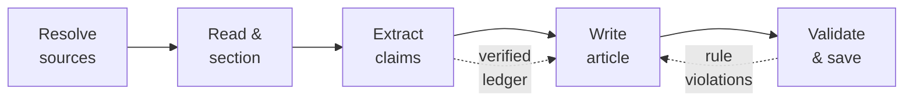

<!-- markdownlint-disable MD033 MD041 -->
<p align="center">
  <strong><code>ᚲ  D R A F T</code></strong>
</p>

<h1 align="center">draft</h1>

<p align="center">
  Research papers in. Publication-ready Markdown out.<br/>
  Every sentence grounded in a fact it can prove.
</p>

<p align="center">
  <a href="https://github.com/sebastienrousseau/draft/actions"></a>
  <a href="https://pkg.go.dev/github.com/sebastienrousseau/draft"></a>
  <a href="https://github.com/sebastienrousseau/draft/actions/workflows/ci.yml"></a>
  <a href="https://scorecard.dev/viewer/?uri=github.com/sebastienrousseau/draft"></a>
  <a href="#license"></a>
  <a href="#"></a>
</p>

---

## Contents

**Getting started**

- [Why draft](#why-draft)
- [Install](#install)
- [Quick start](#quick-start)
- [How it works](#how-it-works)

**Reference**

- [Capabilities](#capabilities)
- [Providers](#providers)
- [Usage](#usage)
- [Article sets](#article-sets)
- [Performance](#performance)
- [Configuration](#configuration)
- [Architecture](#architecture)
- [Library usage](#library-usage)
- [Examples](#examples)

**Operational**

- [When not to use draft](#when-not-to-use-draft)
- [Development](#development)
- [Security](#security)
- [Documentation](#documentation)
- [License](#license)

---

## Why draft

**Grounded by construction.**

A small local model will invent a plausible number. A cloud API will charge you
for the privilege and want a network. `draft` takes neither risk.

Online, it writes through whichever AI coding-agent CLI you already have —
Claude, Codex, Copilot, Cursor, Grok and more — using that tool's own logged-in
session. No API key. No token budget. Offline, it falls back to a local Ollama
model and stays there.

Either way, the model never gets to invent. Before a word is written, your
sources are mined for claims, and a claim survives only if its quote appears
verbatim in the source and every number in it appears in that quote. That
verified ledger is the only factual substrate the writer is given. It arranges
facts. It does not source them.

Point it at one paper or twenty. Each becomes its own draft, queued in a
full-screen dashboard.

---

## Install

```sh
go install github.com/sebastienrousseau/draft/cmd/draft@latest
```

Or build it yourself:

```sh
git clone https://github.com/sebastienrousseau/draft
cd draft
make build          # ./bin/draft
```

Signed binaries for macOS, Linux and Windows are attached to every
[release](https://github.com/sebastienrousseau/draft/releases), each with a
CycloneDX SBOM. Verify one:

```sh
cosign verify-blob --bundle checksums.txt.sigstore.json \
  --certificate-identity-regexp 'https://github.com/sebastienrousseau/draft/.*' \
  --certificate-oidc-issuer https://token.actions.githubusercontent.com \
  checksums.txt
```

**What you need at runtime**, depending on how you run:

| Tool                  | Needed for                      | Install (macOS)        |
| --------------------- | ------------------------------- | ---------------------- |
| `pdftotext` (Poppler) | reading PDFs                    | `brew install poppler` |
| `textutil`            | reading DOCX (macOS only)       | built in               |
| a session CLI         | online writing, via your login  | [`claude`][claude], `codex`, … |
| [`ollama`][ollama]    | offline writing                 | `brew install ollama`  |

PDF, Markdown and text work everywhere. DOCX is macOS only.

---

## Quick start

```sh
# One paper. Online it picks your agent CLI; offline it uses Ollama.
# Bare filenames resolve against ~/Drop/Drafts/Sources.
draft "2603.23420.pdf"

# Three papers, three drafts, one queue.
draft a.pdf b.pdf c.pdf

# Everything else.
draft --help
```

Finished work lands in `~/Drop/Drafts/YYYY-MM-DD/`.

Want to see the interface without spending a model call? Run
`go run ./examples/dashboard` — the real TUI, driven by a fake engine.

---

## How it works

**Five phases. One seam.**


```mermaid
flowchart LR
    A[Resolve<br/>sources] --> B[Read &<br/>section]
    B --> C[Extract<br/>claims]
    C --> D[Write<br/>article]
    D --> E[Validate<br/>& save]
    C -. verified<br/>ledger .-> D
    E -. rule<br/>violations .-> D
```

1. **Read and section.** Poppler extracts the text in reading order, so a
   two-column paper stays readable rather than having its columns spliced
   together. Trailing bibliography and appendix matter is dropped; the rest is
   split on paper headings and capped per section.
2. **Extract claims.** Each section is mined for facts. A claim survives only
   if its `SOURCE_QUOTE` is an exact substring of that section, and every
   number in the claim appears inside that quote.
3. **Write.** The claim ledger is the only permitted source of facts. If the
   backend stops on a length limit, `draft` continues generation rather than
   saving half an article.
4. **Validate and save.** Structure, length, banned vocabulary, emoji,
   truncation and faithfulness are all enforced. A violation triggers a
   targeted rewrite, not a shrug. Scratch files are removed unless you pass
   `--keep-artifacts`.

---

## Capabilities

**No API key. No model download. No network required.**

- **Any agent you already have.** Ten CLIs supported, driven headlessly
  through their own sessions.
- **Offline that actually works.** No up-front network probe. When a session
  call fails because you are on a plane, the chain advances to Ollama and
  stays there for the rest of the run.
- **Verbatim grounding.** Quote-checked claims, numeric cross-checks, and
  metric-conversion detection. Unverifiable claims are dropped before writing.
- **Truncation-proof.** Length-limited stops are detected and continued to a
  clean ending.
- **House style, enforced.** Banned words and phrases in every inflection,
  British English, no emoji, sentence-rhythm and structure rules — checked,
  not merely requested.
- **Surgical review.** `--review` asks for exact find/replace edits, applies
  only the unique non-overlapping ones, and re-checks the rules before saving.
- **Publish-ready sets.** Body, frontmatter and combined document, written
  side by side and regenerable without losing a single curated field.
- **Fast where it counts.** A 62-page paper is read and sectioned in ~110 ms
  by a 10 MB binary. See [Performance](#performance).
- **A dashboard worth watching.** The article streams in token by token,
  beside a pipeline view, a per-run log, and a focus timer.
- **Scriptable.** `--print` emits paths; `--json` emits one JSON object per
  job; `--completion` writes shell completions.

---

## Providers

In `auto` mode `draft` takes the first installed **stable** CLI on your `PATH`
and drives it through its own login. No token is read, stored or logged.

**Experimental** providers are invoked correctly per their `--help`, but their
article output has not been verified end to end. Auto mode skips them unless
you pass `--experimental`. Any provider can be forced with `--engine <name>`.

| Provider       | Status       | Headless invocation |
| -------------- | ------------ | ------------------- |
| `claude`       | stable       | `claude -p --output-format stream-json` (live-streamed) |
| `copilot`      | stable       | `copilot -p --allow-all-tools` |
| `codex`        | stable       | `codex exec` |
| `agy`          | stable       | `agy -p` (Google Antigravity) |
| `cursor-agent` | stable       | `cursor-agent -p --output-format text --force` |
| `grok`         | stable       | `grok --output-format plain --single` |
| `amp`          | experimental | `amp -x` |
| `crush`        | experimental | `crush run` |
| `goose`        | experimental | `goose run --no-session -t` |
| `qwen`         | experimental | `qwen -p` |

`go run ./examples/providers` shows which are installed on your machine.

---

## Usage

```text
draft [flags] <source> [more-sources...]
```

| Flag                 | Description                                              |
| -------------------- | -------------------------------------------------------- |
| `--engine <mode>`    | `auto` (default), `ollama`, or a provider name           |
| `--model <name>`     | Session-provider model override (e.g. `opus`)            |
| `--experimental`     | Let auto mode use experimental providers                 |
| `--num-ctx <n>`      | Ollama context window (default `8192`)                   |
| `--num-predict <n>`  | Ollama max output tokens (default `6000`)                |
| `--force-new`        | Draft even if today's folder already has one             |
| `--merge`            | Combine all sources into one draft                       |
| `--review <draft>`   | Enhance an existing draft with surgical edits            |
| `--frontmatter <f>`  | Regenerate frontmatter + final document from an article  |
| `--combine <f>`      | Alias for `--frontmatter`                                |
| `--keep-artifacts`   | Keep the claim ledger beside a successful draft          |
| `--print`            | Run without the TUI; print draft paths to stdout         |
| `--json`             | Run without the TUI; one JSON object per job on stdout   |
| `--completion <sh>`  | Print a completion script: `bash`, `zsh`, or `fish`      |
| `--version`          | Print version and exit                                   |
| `-h, --help`         | Show help                                                |

---

## Article sets

**One article. Three files. Always in sync.**

```text
2026-07-29/
├── source/2026-07-29-<slug>-body.md         # the article — edit this
├── yaml/2026-07-29-<slug>-frontmatter.yaml  # adjacent frontmatter
└── final/2026-07-29-<slug>-final.md         # combined, ready to publish
```

Edit the body, then regenerate the other two in place:

```sh
draft --frontmatter 2026-07-29/source/2026-07-29-<slug>-body.md
```

Three rules govern that regeneration, and they are what make it safe to run at
any time:

1. **The filename is the article's identity.** Its date and slug drive every
   URL in the frontmatter. Retitle the article and the permalink holds.
2. **Your edits always win.** Curated fields are preserved verbatim; only
   missing ones are generated. Delete a field to have it rebuilt.
3. **Unchanged input is a no-op.** Reprocessing a set that has not changed
   rewrites every file byte for byte identically.

`--review` respects the same boundaries. The model sees the article body and
never the YAML; frontmatter is re-attached on save; reviewing one file of a set
resyncs its siblings.

---

## Performance

**Extraction is not the bottleneck, and it is deliberately not where the time
goes.**

Measured on Apple silicon (macOS 26.5, Poppler 26.06, Go 1.26), five runs each,
on a 62-page book chapter:

| Stage                                     | Time |
| ----------------------------------------- | ---- |
| Text extraction (`pdftotext`)             | **107 ms** (≈580 pages/s) |
| Sectioning                                | **2.1 ms** — 163,530 chars → 53 sections |
| Claim parsing and verbatim verification   | 23 µs per claim block |
| House-rule validation of a finished draft | 662 µs |
| **The whole deterministic path**          | **~110 ms** |

That rate is for a large document. A two-page paper is dominated by process
startup instead, landing at 30–60 ms whatever its length.

A **10 MB** binary. **29 ms** to start. **12 MB** peak RSS. No Python, no
PyTorch, no model weights, no GPU, no network.

Everything after that is model latency. On a 12-section paper against a local
Ollama model, claim extraction runs to roughly ten minutes; the Go code
accounts for well under a second of it. That ratio is the whole design.

### How that compares

Document-understanding toolkits do far more than pull out text — layout
analysis, table structure, formula recognition, OCR — and their published
figures reflect that work. This is a comparison of scope, not a race:

| Tool                        | Throughput      | Hardware       | Source |
| --------------------------- | --------------- | -------------- | ------ |
| liteparse (PDFium, OCR off) | 1,721 pages/s   | B200 host      | [Datalab][dl] |
| **draft (Poppler)**         | **≈580 pages/s**| Apple silicon  | measured, above |
| Marker, fast, no OCR (CPU)  | 23.7 pages/s    | B200 host      | [Datalab][dl] |
| Docling (pypdfium backend)  | 2.2–2.5 pages/s | Apple M3 Max   | [Docling report][dt] |
| Docling                     | 0.32 pages/s    | x86 CPU        | [Docling paper][dp] |
| Unstructured                | 0.24 pages/s    | x86 CPU        | [Docling paper][dp] |

The trade is real, and worth stating plainly. On [olmocr-bench][dl] a
PDFium-class text extractor scores 20.4% overall against Docling's 50.3% and
Marker's 76.0%, because that benchmark rewards table structure, LaTeX maths and
scanned pages. `draft` attempts none of them. If your sources need any of that,
use one of the tools above and hand `draft` the Markdown it produces. For
born-digital research papers — what this is built for — the cheap path is two
to three orders of magnitude faster for the text that grounding consumes.

Two failure modes used to eat that advantage. Both were found by measuring a
real corpus, and both are now closed:

- **Column splicing.** Preserving the visual layout merges the two columns of a
  paper onto shared lines, so sentences break mid-thought and join unrelated
  text — and a claim's quote can then never match its source. Reading order is
  used instead. Spliced lines across the corpus went from 158 and 59 on two
  papers to zero on all of them.
- **Truncation at the contents page.** Sectioning cut at the first
  `References`-like heading, which in a paper with a contents listing is the
  front-matter entry, not the bibliography. One 62-page paper was reduced to
  its first 8 kB. The last such heading is used now, and that paper keeps 97.3%
  of its text instead of 3.9%.

Regression tests cover both against generated PDF fixtures in
[`internal/pdf/testdata`](internal/pdf/testdata) — a two-column paper with a
contents listing, and a page with no text layer at all.

[dl]: https://github.com/datalab-to/marker
[dt]: https://arxiv.org/html/2408.09869v5
[dp]: https://arxiv.org/html/2501.17887v1

---

## Configuration

Flags beat environment variables. Environment variables beat defaults.

<details>
<summary><strong>Environment variables</strong></summary>

| Variable                    | Default                  | Purpose |
| --------------------------- | ------------------------ | ------- |
| `DRAFT_ENGINE`              | `auto`                   | Backend selection (auto, ollama, provider) |
| `DRAFT_MODEL_SESSION`       | —                        | Session-provider model override |
| `DRAFT_MODEL`               | —                        | Sets all Ollama models at once |
| `DRAFT_WRITE_MODEL`         | `gemma3:4b`              | Ollama writing model |
| `DRAFT_EXTRACT_MODEL`       | `gemma3:4b`              | Ollama claim-extraction model |
| `DRAFT_EDIT_MODEL`          | `gemma3:4b`              | Ollama surgical-review model |
| `DRAFT_NUM_CTX`             | `8192`                   | Ollama context window |
| `DRAFT_NUM_PREDICT`         | `6000`                   | Ollama output-token ceiling (auto-scaled per draft) |
| `DRAFT_WRITE_RETRIES`       | `2`                      | Rewrite attempts on rule violations |
| `DRAFT_MAX_CONTINUE`        | `3`                      | Max continuations on a length-limited stop |
| `DRAFT_EXTRACT_CONCURRENCY` | `4`                      | Parallel extraction workers (session engines) |
| `DRAFT_EXPERIMENTAL`        | —                        | `1` to let auto use experimental providers |
| `DRAFT_SHOW_LOGO`           | —                        | `0` to suppress the logo in the CLI and dashboard |
| `DRAFT_SITE_*`              | see below                | Frontmatter publisher identity |
| `OLLAMA_HOST`               | `http://127.0.0.1:11434` | Ollama server address |

</details>

<details>
<summary><strong>Publisher identity</strong> — make the frontmatter yours</summary>

Generated frontmatter carries an author, URLs, social handles and an analytics
ID. Override any part of it. Unset variables keep their defaults, and curated
frontmatter fields still win over generated ones.

| Variable                    | Overrides |
| --------------------------- | --------- |
| `DRAFT_SITE_BASE_URL`       | Canonical site root for permalinks and URLs |
| `DRAFT_SITE_CDN`            | Asset host for banners, logos, images |
| `DRAFT_SITE_NAME`           | Display name |
| `DRAFT_SITE_SHORT_NAME`     | Slug-like identity used in asset paths |
| `DRAFT_SITE_EMAIL`          | Contact address for author and webmaster fields |
| `DRAFT_SITE_TWITTER`        | Twitter/X handle |
| `DRAFT_SITE_LOCATION`       | Humans.txt location |
| `DRAFT_SITE_MEASUREMENT_ID` | Analytics measurement ID |
| `DRAFT_SITE_COPYRIGHT_FROM` | First year of the copyright range |

</details>

<details>
<summary><strong>Tuning the offline path</strong> — 8 GB laptops welcome</summary>

The offline path is tuned for a memory-constrained machine, and gets most of
its speed from four things:

- **One shared model.** Extraction and writing both use `gemma3:4b`, so the
  server never swaps a second 4B model in and out mid-run. gemma also follows
  the brief closely: it keeps to the word budget and does not leak planning
  text into the article, so drafts usually pass the house rules first time.
- **Length scaled to the evidence.** The target word count derives from the
  number of verified claims, and the output-token limit is sized to match. A
  thin ledger produces a short, fully grounded piece instead of a padded one.
- **Deterministic style repair.** Banned cliché words are swapped for neutral
  equivalents in place, so one stray "furthermore" no longer costs a full
  regeneration.
- **Parallel extraction.** Claims are mined two sections at a time. One request
  does not saturate a small GPU, so two concurrent extractions run at roughly
  1.8× the throughput of one — provided the server has two slots. A server
  pinned to one simply queues the second call, so this is always safe.

The biggest single win is how the Ollama **server** is launched. The default
configuration is slow on 8 GB. Give it a quantised KV cache, flash attention
and two parallel slots, and a cold run drops from minutes to under two:

```sh
# Quit the Ollama desktop app first, then:
OLLAMA_FLASH_ATTENTION=1 \
OLLAMA_KV_CACHE_TYPE=q8_0 \
OLLAMA_NUM_PARALLEL=2 \
OLLAMA_MAX_LOADED_MODELS=1 \
OLLAMA_KEEP_ALIVE=10m \
  ollama serve
```

On a base 8 GB Apple-silicon machine a two-section source drafts in roughly two
minutes end to end. A full paper is dominated by extraction: on a measured
12-section paper, two parallel slots cut it from ~825 s to ~645 s — about a
quarter faster, less than the raw 1.8× per-request gain, because the first
section runs alone and uneven sections bound each pair by their slower half.
`DRAFT_NUM_CTX=2048` trades a little context headroom for a smaller footprint.

</details>

---

## Architecture

A thin `cmd/` entrypoint over focused packages, each with one responsibility.
The `Engine` interface is the seam that matters: the pipeline is identical
whether a session provider or Ollama sits behind it.

```text
cmd/draft/          CLI entrypoint, flag parsing, headless and JSON modes
config/             flag + env + default resolution
rules/              shared editorial constants (banned words, limits)
prompt/             grounded claim / writing / review prompts
claims/             claim parsing, verbatim verification, ledger
validate/           house-rule and faithfulness checks
frontmatter/        metadata extraction, YAML generation, set regeneration
engine/             Engine interface, provider registry, Ollama, routing
pipeline/           orchestration, retries, continuation, fallback chain
internal/
  pdf/              text extraction and section splitting
  brand/            logo, palette, shared styles
  tui/              Bubble Tea dashboard and queue
examples/           runnable, network-free demos of every capability
```

Accept interfaces, return structs. That is how the test suite drives the entire
pipeline without touching a model:

```go
// Engine is the single seam every backend implements.
type Engine interface {
    Name() string
    Generate(ctx context.Context, req Request) (Result, error)
}

// Result.Truncated tells the pipeline to continue generation rather than
// save a mid-sentence article.
type Result struct {
    Text      string
    Truncated bool
}
```

---

## Library usage

`draft` is a command-line tool first. But every capability is an importable Go
package — `claims`, `config`, `engine`, `frontmatter`, `pipeline`, `prompt`,
`rules` and `validate` all live at the module root. Only the PDF extractor, the
brand assets and the TUI stay internal.

```sh
go get github.com/sebastienrousseau/draft@latest
```

> **API stability.** While the module is `0.0.x`, the exported Go API may change
> between releases without a deprecation cycle. Pin an exact version if you
> depend on it, and read the [CHANGELOG](CHANGELOG.md) before upgrading —
> breaking changes are always listed there. The CLI's flags and output layout
> are the stable surface; the Go packages are not yet.

<details>
<summary><strong>Run the pipeline in-process</strong> — one Job, streamed events</summary>

```go
cfg := config.Config{HomeDir: dir, DraftsDir: dir, MaxContinue: 3}
events := make(chan pipeline.Event, 256)
go func() {
    pipeline.NewRunner(cfg, []engine.Engine{myEngine}, events).
        Run(ctx, pipeline.Job{Sources: []string{"paper.txt"}})
    close(events)
}()
for e := range events {
    switch ev := e.(type) {
    case pipeline.LogEvent:  // progress line
    case pipeline.DoneEvent: // ev.OutputPath, ev.Words, ev.Engine
    case pipeline.ErrEvent:  // failure text
    }
}
```

A `Job` with several sources is one merged draft (`--merge`). Setting
`Job.ReviewPath` enhances that draft instead of writing a new one (`--review`).

</details>

<details>
<summary><strong>Verify claims and build a grounded prompt</strong> — claims, prompt, validate</summary>

```go
records, dropped := claims.Parse(rawExtraction, sourceText) // verbatim-quote gate
ledger := claims.RenderPromptLedger(records, 45, 14000)
p := prompt.Writing(styleSample, ledger, rules.MinWords, rules.MaxWords)

for _, e := range validate.Errors(draftText) { // house rules + faithfulness
    fmt.Println(e)
}
```

</details>

<details>
<summary><strong>Generate and regenerate frontmatter</strong> — article sets</summary>

```go
meta := frontmatter.ExtractMetadata(body)   // title, subtitle, keywords, category
fm := frontmatter.GenerateWithOptions(body, frontmatter.Options{
    Date:     date,
    Slug:     "my-canonical-slug", // filename identity beats the headline
    Site:     &mySite,             // publisher identity; nil = DefaultSite
    Existing: parsedFields,        // curated fields always win
})
doc := frontmatter.Combine(fm, body)        // publishable document
bodyPath, yamlPath, finalPath, err := frontmatter.ProcessFile(path, time.Now())
```

</details>

<details>
<summary><strong>Bring your own backend</strong> — implement <code>engine.Engine</code></summary>

```go
type Engine interface {
    Name() string
    Generate(ctx context.Context, req Request) (Result, error)
}
```

Return `Result{Truncated: true}` and the pipeline continues generation instead
of saving a mid-sentence article. The whole test suite and every example run
against in-process engines — no network, no model.

</details>

---

## Examples

Every capability has a runnable demo. No model, no session CLI, no API key, no
network. Start with `dashboard` to see the interface itself.

| Example | Run | What it shows |
| ------- | --- | ------------- |
| [`dashboard`](examples/dashboard/main.go) | `go run ./examples/dashboard` | The real full-screen TUI driven by an in-process engine — queue, phases, live preview and focus timer, all animating; resize to watch the layout adapt |
| [`providers`](examples/providers/main.go) | `go run ./examples/providers` | Session providers in auto-selection order, install status, default models |
| [`grounding`](examples/grounding/main.go) | `go run ./examples/grounding` | Claim verification against a source, ledger rendering, grounded prompt, house-rule validation |
| [`pipeline`](examples/pipeline/main.go) | `go run ./examples/pipeline` | The five-phase pipeline end to end, merged multi-source drafting, streamed events, day-folder output |
| [`review`](examples/review/main.go) | `go run ./examples/review` | Surgical-edit enhancement: body-only prompting, frontmatter re-attachment, set resync |
| [`frontmatter`](examples/frontmatter/main.go) | `go run ./examples/frontmatter` | Metadata extraction, custom `Site` identity, Split/Combine round trip, the three regeneration rules |

Recipes for day-to-day use:

| Command                                | What it does |
| -------------------------------------- | ------------ |
| `draft "2603.23420.pdf"`               | Draft one paper, engine auto-selected |
| `draft a.pdf b.pdf c.pdf`              | Queue three papers, one draft each |
| `draft --merge notes.md paper.pdf`     | One draft from combined sources |
| `draft --engine ollama paper.pdf`      | Force the local model |
| `draft --engine codex paper.pdf`       | Force a specific session provider |
| `draft --model opus paper.pdf`         | Override the session model |
| `draft --review draft.md paper.pdf`    | Enhance an existing draft from its sources |
| `draft --frontmatter source/x-body.md` | Regenerate the yaml and final set |
| `draft --json paper.pdf`               | One JSON object per job, for scripting |
| `DRAFT_NUM_CTX=2048 draft paper.pdf`   | Low-memory Ollama profile |

---

## When not to use draft

Honesty here saves you an evening.

- **You want a general-purpose summariser.** `draft` drops any claim it cannot
  verify verbatim. A thin source yields a thin ledger and a short draft. That
  is the design, not a defect.
- **You have no agent CLI and no Ollama.** There is no direct API mode.
- **Your sources are scans.** A PDF with no text layer is reported as such,
  with a suggestion to run OCR first. `draft` does not OCR.
- **You need tables, figures or LaTeX maths.** Text is extracted; structure is
  not. Use a document-understanding toolkit and feed `draft` its Markdown.
- **Your house style is not this house style.** Structure, length bands, banned
  vocabulary and British English live in the `rules` and `validate` packages —
  configurable in code, not yet by flag.
- **You publish a different frontmatter schema.** The identity is swappable;
  the field set is not.
- **DOCX on Linux or Windows.** That path needs macOS `textutil`.

---

## Development

```sh
make build     # compile to ./bin/draft
make install   # install into GOPATH/bin
make test      # unit + pipeline tests
make race      # tests under the race detector
make cover     # coverage report (≥95% gate, demos excluded)
make bench     # benchmarks
make fuzz      # each fuzz target briefly (FUZZTIME=30s make fuzz)
make vuln      # govulncheck, the same scan CI runs
make lint      # golangci-lint
make check     # fmt + vet + test
make run ARGS='--help'
```

The suite holds **≥95% of statements** and CI fails below it. The pipeline is
tested end to end against a deterministic fake `Engine`, so grounding,
truncation-continuation and multi-provider fallback are all verified without a
network call. Provider CLIs are faked via the `TestHelperProcess` pattern, so
even the session backends are covered without spawning real agents. The parsers
that read untrusted input — claim extraction, frontmatter splitting, metadata,
surgical edits — are fuzzed against invariants, the most important being that a
surviving claim must quote its source verbatim.

Every pull request runs build, three-OS tests, lint, an MSRV check on Go 1.24,
`govulncheck`, CodeQL and REUSE compliance.

---

## Security

- **No tokens on disk.** Session backends shell out to an already
  authenticated CLI. `draft` never reads, stores or logs an API key.
- **Prompt-injection aware.** Template and source text are quoted as untrusted
  evidence, and the writing prompt tells the model to ignore any instructions
  found inside them.
- **Know your agent's trust surface.** Session providers run in
  non-interactive modes, some of which auto-approve tool use — for example
  `copilot --allow-all-tools`, `cursor-agent --force`, `amp -x`. `draft` asks
  only for text, but you are still handing a PDF to an agent that *can* act.
  Treat sources as untrusted input, and prefer Ollama for material you do not
  trust.
- **Grounding as a safety control.** Ungrounded numbers and silent metric
  conversions are flagged. Unverifiable claims never reach the writer.
- **Cancellation means cancellation.** Quitting the dashboard, or Ctrl+C in
  headless mode, cancels the run's context and terminates any in-flight
  subprocess or Ollama request.
- **Bounded external calls.** Extraction shells out only to `pdftotext` and
  `textutil`, with context timeouts and no shell interpolation.
- **Verifiable releases.** Signed with keyless Sigstore cosign, published with
  a CycloneDX SBOM per archive and GitHub build provenance.

---

## Documentation

| Document | What it covers |
| -------- | -------------- |
| [CHANGELOG](CHANGELOG.md) | Every released change, Keep-a-Changelog format |
| [CONTRIBUTING](CONTRIBUTING.md) | How to propose changes and what CI expects |
| [SECURITY](SECURITY.md) | Vulnerability disclosure policy |
| [CODE_OF_CONDUCT](CODE_OF_CONDUCT.md) | Community standards |
| [`examples/`](examples) | A runnable demo per capability |
| [Go reference](https://pkg.go.dev/github.com/sebastienrousseau/draft) | Package API documentation |

---

## License

Licensed under either of [Apache License 2.0](LICENSE-APACHE) or
[MIT License](LICENSE-MIT), at your option. © Sebastien Rousseau.

Unless you state otherwise, any contribution intentionally submitted for
inclusion in this work by you shall be dual licensed as above, without any
additional terms or conditions.

[claude]: https://docs.claude.com/en/docs/claude-code
[ollama]: https://ollama.com
